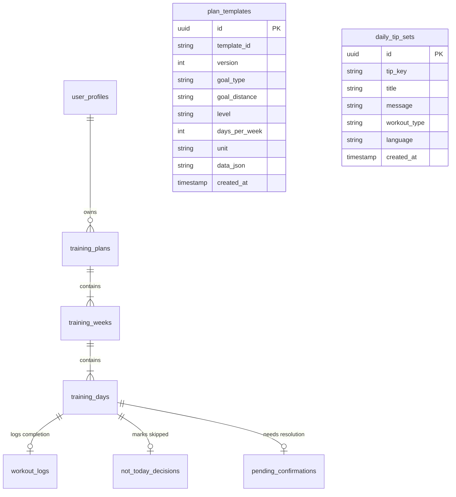

# Database Documentation

This document describes the database schema, entity definitions, relationships, seeding logic, and migrations for the Antigravity application.

---

## 1. Database Engine & ORM
- **Database Engine**: PostgreSQL
- **Object-Relational Mapper (ORM)**: Entity Framework Core 9.0 (EF Core)
- **Npgsql Provider**: `Npgsql.EntityFrameworkCore.PostgreSQL`
- **Naming Policy**: Column and table names map to lowercase snake_case in PostgreSQL through standard Entity Framework configuration conventions.

---

## 2. Entity Diagram

The following Mermaid diagram outlines the primary tables and their relationships in the database:



---

## 3. Entity Descriptions

### 3.1 UserProfile
Stores high-level preference details for a user.
- `Id` (GUID, PK): Unique profile identifier.
- `UserId` (String, Unique Index): Subject identifier mapped from identity token (mocked to `mock-user-001`).
- `Name` (String): Display name.
- `Email` (String): User's email.
- `Unit` (Enum/String): `Km` or `Miles`.
- `RunningBackground` (Enum/String): `NewToRunning`, `SlightlyActive`, `ConsistentRunner`.
- `CreatedAt`/`UpdatedAt` (DateTime)

### 3.2 PlanTemplate
Stores structured template blueprints from which actual user training plans are instantiated.
- `Id` (GUID, PK): Unique identifier.
- `TemplateId` (String, Unique Index): Semantic key, e.g., `habit_5k_beginner_3day_km_v1`.
- `Version` (Integer): Incremental version number.
- `GoalType` (Enum/String): `Habit` or `Race`.
- `GoalDistance` (Enum/String): `FiveK`, `TenK`, `HalfMarathon`, `Marathon`.
- `Level` (Enum/String): Runner's experience tier.
- `DaysPerWeek` (Integer): Number of running slots per week (e.g. 3 or 4).
- `Unit` (Enum/String): `Km` or `Miles`.
- `DataJson` (String): Raw JSON payload defining weekly running structures (build weeks, distance ratios, etc.).

### 3.3 TrainingPlan
Represents an instantiated, active, completed, or cancelled training plan for a user.
- `Id` (GUID, PK): Unique plan identifier.
- `UserId` (String): The owner user ID.
- `TemplateId` (String): The parent template reference key.
- `Status` (Enum/String): `Active`, `Completed`, `Cancelled`, `Archived`.
- `GoalType` (Enum/String)
- `GoalDistance` (Enum/String)
- `GoalDistanceKm` (Double, Nullable)
- `Level` (Enum/String)
- `DaysPerWeek` (Integer)
- `Unit` (Enum/String)
- `RaceName` (String, Nullable)
- `RaceDate` (DateTime, Nullable)
- `TargetFinishTimeSeconds` (Integer, Nullable)
- `StartedAt` (DateTime)
- `EstimatedEndDate` (DateTime)
- `CompletedAt` (DateTime, Nullable)
- `CancelledAt` (DateTime, Nullable)
- `CreatedAt` (DateTime)

### 3.4 TrainingWeek
Groups calendar training days into weekly chunks under a plan.
- `Id` (GUID, PK): Unique week identifier.
- `PlanId` (GUID, FK): Associated training plan.
- `WeekNumber` (Integer): Sequential week index (e.g., 1 to 8).
- `WeekType` (Enum/String): `Build`, `Recovery`, `Taper`, `RaceWeek`.

### 3.5 TrainingDay
A specific day on the calendar showing what the runner should do.
- `Id` (GUID, PK): Unique day identifier.
- `WeekId` (GUID, FK): Associated training week.
- `PlanId` (GUID, FK): Associated training plan (restricted delete configuration for PostgreSQL compliance).
- `Date` (DateTime): Specific calendar date.
- `DayType` (Enum/String): `Easy`, `Interval`, `Tempo`, `LongRun`, `RecoveryEasy`, `Rest`.
- `Status` (Enum/String): `Planned`, `Completed`, `Missed`, `Skipped`, `Pending`.
- `Title` (String): Display title (e.g., "Easy 3k Run").
- `Description` (String): Long form instructions.
- `PlannedDistanceKm` (Double)
- `PlannedDurationMin` (Integer)
- `PlannedPaceMinKm` (Double, Nullable)
- `Intensity` (String, Nullable)
- `IsLongRun` (Boolean)
- `CanMarkComplete` (Boolean)
- `CanMarkNotToday` (Boolean)

### 3.6 WorkoutLog
Logs the actual recorded performance details when a user completes a workout.
- `Id` (GUID, PK): Unique log identifier.
- `DayId` (GUID, FK): The completed training day.
- `UserId` (String): User reference.
- `ActualDistanceKm` (Double)
- `ActualDurationMin` (Integer)
- `LoggedAt` (DateTime)
- `Notes` (String, Nullable)

### 3.7 NotTodayDecision
Tracks skips when a user clicks "Not Today" on a planned run.
- `Id` (GUID, PK)
- `DayId` (GUID, FK)
- `UserId` (String)
- `Reason` (String): e.g., "Too busy", "Injured / Sore".
- `CreatedAt` (DateTime)
- `ConfirmedAt` (DateTime, Nullable): Confirms the decision has been logged.

### 3.8 PendingConfirmation
A run that was skipped via "Not Today" but requires subsequent resolution on the next session.
- `Id` (GUID, PK)
- `DayId` (GUID, FK)
- `UserId` (String)
- `Reason` (String)
- `CreatedAt` (DateTime)
- `ResolvedAt` (DateTime, Nullable)
- `ResolutionAction` (String, Nullable): `rest` (skip), `tomorrow` (shift), `log` (retroactively complete).

### 3.9 DailyTipSet
Stores motivational daily tips that are fetched and presented on the Home screen.
- `Id` (GUID, PK)
- `TipKey` (String)
- `Title` (String)
- `Message` (String)
- `WorkoutType` (Enum/String, Nullable)
- `Language` (String)

---

## 4. Relationships Configuration

Wired inside `AppDbContext.OnModelCreating`:
- **TrainingPlan -> TrainingWeek**: Cascade Delete. Deleting a plan wipes all associated weeks.
- **TrainingWeek -> TrainingDay**: Cascade Delete. Deleting a week wipes all associated days.
- **TrainingDay -> TrainingPlan**: Restricted Delete. Bypasses multiple cascade paths inside PostgreSQL to ensure stable operations.
- **UserProfile Index**: Unique index configured on `UserId` column.
- **PlanTemplate Index**: Unique index configured on `TemplateId` column.

---

## 5. Seed Data Details

The system seeds the following records during initial migration setup:

### 5.1 Plan Templates
1. `habit_5k_beginner_3day_km_v1` (GUID: `11111111-...`): Beginners training for a 5k running 3 days a week.
2. `habit_5k_beginner_4day_km_v1` (GUID: `22222222-...`): Beginners training for a 5k running 4 days a week.
3. `race_5k_beginner_3day_km_v1` (GUID: `33333333-...`): Beginners training for a 5k race running 3 days a week (includes interval runs).

### 5.2 Daily Tips
- `easy_run_tip_01` ("Keep it comfortable"): Seeding for Easy workouts.
- `long_run_tip_01` ("Find your rhythm"): Seeding for Long Run workouts.
- `rest_tip_01` ("Rest with intent"): Seeding for Rest days.
- `missed_tip_01` ("No worries"): Generic supportive tip for skips.
- `completed_tip_01` ("Well run!"): Celebration tip.

---

## 6. Migration Commands

To add a new migration or update the schema:
```powershell
# Add a migration
dotnet ef migrations add <MigrationName> --project RunningApp.Persistence --startup-project RunningApp.Api

# Apply migrations to database
dotnet ef database update --project RunningApp.Persistence --startup-project RunningApp.Api

# Rollback last migration
dotnet ef database update <PreviousMigrationName> --project RunningApp.Persistence --startup-project RunningApp.Api
```
The initial schema setup migration is `20260624105830_InitialCreate`.
