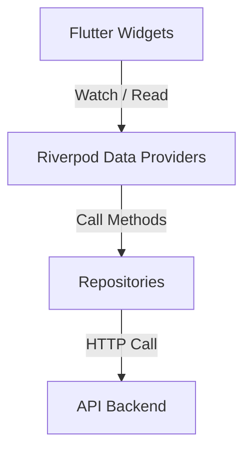

# Frontend Documentation

This document describes the design system, page routes, navigation structure, and Riverpod state management architecture of the Flutter mobile application.

---

## 1. Routing & Navigation Map

Navigation is managed using **GoRouter**. The application splits screens into onboarding/pre-auth routes and main-app routes using a bottom navigation bar layout Shell.

### Route Hierachy:

```
[Welcome Screen] (initialLocation: /auth)
  ├── /auth/signup (Sign Up Page)
  └── /auth/signin (Sign In Page)

[Onboarding Paths]
  ├── /intro (Intro Carousel)
  └── /onboarding
       ├── /goal (Goal Selection)
       ├── /race-details (Race Details Form)
       ├── /background (Running Background)
       ├── /habit-goal (Habit Goal Details)
       ├── /custom-goal (Custom Distance Selector)
       ├── /frequency (Weekly Frequency)
       ├── /days (Days Selection)
       ├── /long-run-day (Long Run Day Selector)
       ├── /start-date (Start Date Picker)
       ├── /generating (Plan Generating Screen)
       └── /plan-preview (Plan Preview Grid)

[Main App Shell] (Bottom Navigation Bar)
  ├── /home (Home Page)
  ├── /calendar (Calendar Page)
  └── /profile (Profile Page)

[Top Level Overlays]
  ├── /settings (Settings Screen)
  ├── /profile/plan-details (Active Plan Details Grid)
  ├── /pending-confirmation (Resolve Pending Skips Screen)
  └── /training-day/:dayId (Workout Detail Page)
```

---

## 2. Screen Reference

The frontend implements **22 distinct screens/states** corresponding to the MVP requirements:

| Screen Name | Path | Description |
|---|---|---|
| **Welcome** | `/auth` | Entry screen introducing the brand value. |
| **Sign Up** | `/auth/signup` | Form for registering user profile details (mocked). |
| **Sign In** | `/auth/signin` | Form for existing users (mocked). |
| **Intro Carousel** | `/intro` | Carousel explaining the supportive adaptation system. |
| **Goal Selection** | `/onboarding/goal` | Main decision branch between Habit, Race, and Custom paths. |
| **Race Details** | `/onboarding/race-details` | Form capturing target race name and dates. |
| **Running Background** | `/onboarding/background` | Slider capturing previous running experience tier. |
| **Habit Goal** | `/onboarding/habit-goal` | Configurator for habit-building running plans. |
| **Custom Goal** | `/onboarding/custom-goal` | Form for selecting custom distances (e.g. 8k). |
| **Weekly Frequency** | `/onboarding/frequency` | Choice of 3 or 4 runs per week. |
| **Running Days Selection**| `/onboarding/days` | Multi-select for weekly running days matching frequency. |
| **Long Run Day Preference**| `/onboarding/long-run-day`| Pinpoint day of week designated for long workouts. |
| **Start Date Selection** | `/onboarding/start-date` | Calendar selector for first active workout date. |
| **Plan Generation** | `/onboarding/generating` | Engaging skeleton spinner simulating API generation. |
| **Plan Preview** | `/onboarding/plan-preview`| Grid showing preview weeks before plan confirmation. |
| **Home** | `/home` | Main dashboard displaying today's run, weekly stats. |
| **Calendar** | `/calendar` | Grid of monthly workouts color-coded by performance status. |
| **Training Day Detail** | `/training-day/:dayId` | Core page describing planned, completed, missed, or rest details. |
| **Pending Confirmation** | `/pending-confirmation` | Board listing skipped runs waiting for resolution actions. |
| **Profile** | `/profile` | Dashboard showing streaks, overall mileage, and cancel plan CTAs. |
| **Plan Details** | `/profile/plan-details` | Complete overview listing all weeks and days of active plan. |
| **Settings** | `/settings` | Static profile parameters and notification sliders. |

---

## 3. State Management Architecture

State is decoupled from the UI using **Riverpod**. Providers fall into three layers:
1. **Repository Providers**: Singletons delivering HTTP client operations.
2. **State Controllers (Notifiers)**: Stateful controllers managing UI configurations (e.g., onboarding forms).
3. **Data Providers (Futures/Async)**: Caching query providers reading data from API endpoints.



### 3.1 Core Provider Registry

- `bootstrapDataProvider`: `FutureProvider` checking user active plan state.
- `onboardingProvider`: `StateNotifierProvider` storing values during the onboarding steps.
- `homeDataProvider`: `FutureProvider` supplying today's workout, weekly recap, and daily tips.
- `calendarDataProvider`: `FutureProvider` fetching workouts in calendar view for the selected month.
- `calendarMonthProvider`: `StateProvider` managing YYYY-MM navigation string.
- `profileOverviewProvider`: `FutureProvider` fetching all-time user statistics.
- `activePlanDetailsProvider`: `FutureProvider` fetching weeks, days, and milestones.
- `trainingDayDetailProvider(dayId)`: `FutureProviderFamily` loading details of a specific day.
- `pendingConfirmationsProvider`: `FutureProvider` tracking unconfirmed skips.

---

## 4. Repository Design Pattern

All API endpoints are requested via structured repositories:

### 4.1 PlanRepository
- **Endpoints**: `/plans/generate-preview`, `/plans/confirm`, `/plans/active/details`, `/plans/{id}/cancel`
- **File**: `mobile/lib/features/plan/data/plan_repository.dart`

### 4.2 HomeRepository
- **Endpoints**: `/plans/active/home`, `/training-days/{id}/complete`, `/training-days/{id}/not-today-decisions`, `/not-today-decisions/{id}/confirm`, `/pending-confirmations`, `/pending-confirmations/resolve`
- **File**: `mobile/lib/features/home/data/home_repository.dart`

### 4.3 CalendarRepository
- **Endpoints**: `/plans/active/calendar`
- **File**: `mobile/lib/features/calendar/data/calendar_repository.dart`

### 4.4 ProfileRepository
- **Endpoints**: `/profile/overview`
- **File**: `mobile/lib/features/profile/data/profile_repository.dart`

---

## 5. UI Custom Design System

The app implements a premium custom design system mapping directly to the branding reference specifications.

### 5.1 Tokens
- **AppColors**: Sleek dark mode colors:
  - `background`: `#121214` (Very dark grey)
  - `surface`: `#1C1C1E` (Dark grey card base)
  - `primary`: `#FF5E3A` (Vibrant coral accent)
  - `completed`: `#34C759` (Soft green)
  - `missed`: `#FF3B30` (Soft red)
  - `restTint`: `#2C2C2E` (Neutral grey rest shade)
- **AppTextStyles**: Typography using **Inter** font family with clear hierarchies (`h1` bold 28pt, `h2` semi-bold 20pt, `displayLarge` bold 48pt).
- **AppSpacing**: Increments from `xs` (4dp) to `xxl` (48dp).

### 5.2 Common Widgets
- `AppPrimaryButton`: Branded coral button with micro-scale animations.
- `AppSecondaryButton`: Border outlined neutral button.
- `AppCard`: Surface-colored card wrapper with rounded corners.
- `StatusIndicator`: Customizable indicator showing workout completion states.
- `EmptyState` & `LoadingState`: Structured UI templates displaying status details.
