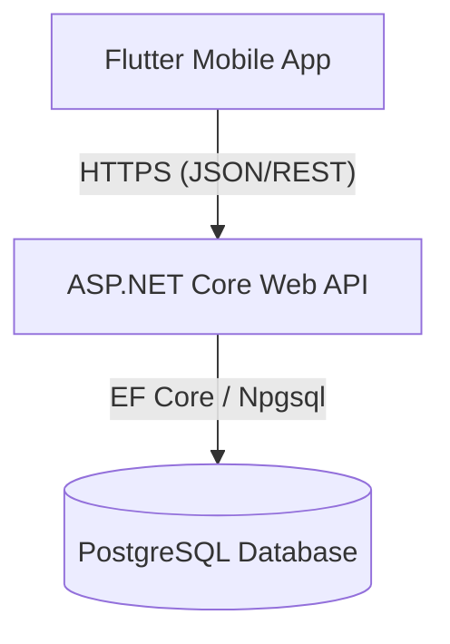

# **flutter**run**-**d**windows**Antigravity — Adaptive Running App

> A calm, guilt-free running planner designed to help people build consistent running habits and prepare for races without the stress of rigid schedules.

---

## 1. Product Overview & MVP Scope

Antigravity is an adaptive training platform that dynamically adjusts running plans to the user's real-life compliance. Instead of penalizing missed runs, it leverages a supportive design philosophy to adapt future workouts gently.

### MVP (Phase 1) Scope:

- **Calm, Supportive Experience**: Gentle wording and states for missed runs, rest days, and confirmations.
- **Onboarding Flow**: Structured steps collecting goal type, target distance, level of experience, frequency, day-of-week preferences, start date, and plan generation preview.
- **Three Core Tabs**:
  - **Home**: Today's workout details, action buttons (Complete / Not Today), weekly mini-calendar, weekly progress, and dynamic tips. Supports special states like "Plan Completed" and "No Active Plan".
  - **Calendar**: Complete monthly overview mapping completed runs, missed runs, planned runs, and rest days, including monthly summary statistics.
  - **Profile**: Displays weekly stats, active plan summary, options to cancel/stop plans, and settings.
- **Backend & Persistence**: Fully connected ASP.NET Core Web API with PostgreSQL database, migrations, and seed data.
- **Placeholder Adaptation Engine**: Stubbed engine structure that is ready to be swapped out for a real adaptive algorithm in Phase 2.

---

## 2. Architecture Overview

Antigravity is built as a split-client architecture:

1. **Frontend**: A cross-platform mobile app built with Flutter (Dart), utilizing Riverpod for state management, GoRouter for navigation, and Dio for network requests.
2. **Backend**: A clean-architecture ASP.NET Core Web API built with .NET 9, using Entity Framework Core for ORM and Npgsql for PostgreSQL integration.
3. **Database**: PostgreSQL storing user profiles, active plans, generated calendar days, workout completion logs, and "not today" decisions.



### Backend layering

The API follows a conventional Clean Architecture split:

```
RunningApp.Api            Controllers, middleware, Program.cs (DI wiring)
        ↓ depends on
RunningApp.Application     Services, DTOs, interfaces, identity/adaptation/
                            plan-generation abstractions — the business layer
        ↓ depends on
RunningApp.Domain          Entities, enums — no dependencies on anything else
RunningApp.Persistence     AppDbContext, EF Core migrations, seed data
```

Controllers are thin: they resolve the current user via `ICurrentUserAccessor`
and delegate everything else to an Application service. No controller
contains business logic, and no Application service knows about HTTP.

### Cross-cutting concerns

| Concern | Where | Notes |
|---|---|---|
| Correlation IDs | `RunningApp.Api/Logging/CorrelationIdAccessor.cs` | Reuses the `X-Correlation-Id` request header if the caller sends one, otherwise generates a GUID. Echoed back as a response header. |
| Request logging | `RunningApp.Api/Logging/RequestLoggingMiddleware.cs` | One structured log line per request: correlation id, method, path, status code, elapsed ms, resolved user id. Never logs request/response bodies. |
| Error responses | `RunningApp.Api/ErrorHandling/GlobalExceptionHandler.cs` | Maps `NotFoundAppException` → 404, `ConflictAppException` → 409, `ArgumentException` → 400, anything else → 500, all as the standardized `ApiErrorResponse` envelope (see §7). |
| Health checks | `RunningApp.Api/Controllers/HealthController.cs` | `GET /health` (liveness) and `GET /health/database` (connectivity + pending migrations). Outside `/api/v1`, dev-diagnostics only. |

---

## 3. Project Structure

### Flutter (Frontend)

Located in `/mobile`:

```
mobile/
├── lib/
│   ├── main.dart                      # App entry point
│   ├── app.dart                       # Root Material App configuration
│   ├── core/                          # Cross-cutting concerns
│   │   ├── network/                   # API client (Dio wrapper), DTOs, bootstrap provider
│   │   ├── routing/                   # GoRouter configuration & routes
│   │   ├── theme/                     # AppTheme, colors, text styles, spacing
│   │   └── widgets/                   # Common reusable widgets (buttons, cards, badges)
│   └── features/                      # Feature modules
│       ├── auth/                      # Welcome screen & sign in / sign up mock flows
│       ├── onboarding/                # Onboarding carousel, goal & day selectors, plan generator
│       ├── plan/                      # Plan details & summary views
│       ├── home/                      # Today's workout card, weekly mini-calendar, daily tips
│       ├── calendar/                  # Grid monthly calendar & month summaries
│       ├── training_day/              # Full-page workout details (planned, completed, missed, rest states)
│       ├── pending_confirmation/       # View & resolve past unlogged workout decisions
│       ├── profile/                   # User stats & stop plan triggers
│       └── settings/                  # Profile settings stub
```

### .NET 9 API (Backend)

Located in `/backend`:

```
backend/
├── RunningApp.sln                     # Visual Studio Solution
├── RunningApp.Api/                    # Controllers, Startup configuration (Program.cs), and appsettings
├── RunningApp.Application/            # Application logic, DTOs, interfaces, and services
├── RunningApp.Domain/                 # Core Entities, Enums, and domain model
├── RunningApp.Infrastructure/         # Future external adapters (placeholder stubs)
└── RunningApp.Persistence/            # Database Context, EF Core Migrations, and seeds
```

---

## 4. Setup & Running Instructions

### Running the Backend

#### Prerequisites:

- .NET 9 SDK
- PostgreSQL database server running (default port `5432`)

#### Instructions:

1. Open [backend/RunningApp.Api/appsettings.json](file:///c:/Users/vatan/Desktop/runner/backend/RunningApp.Api/appsettings.json) and verify or update the connection string:
   ```json
   "ConnectionStrings": {
     "DefaultConnection": "Host=localhost;Database=running_db;Username=postgres;Password=yourpassword"
   }
   ```
2. Navigate to the backend directory:
   ```bash
   cd backend
   ```
3. Install the EF Core CLI tool once per machine, if you don't already have it:
   ```bash
   dotnet tool install --global dotnet-ef
   ```
4. Run the migrations to initialize the database:
   ```bash
   dotnet ef database update --project RunningApp.Persistence --startup-project RunningApp.Api
   ```
5. Run the API project:
   ```bash
   dotnet run --project RunningApp.Api
   ```
   By default (`RunningApp.Api/Properties/launchSettings.json`) this listens on
   `http://localhost:5231` (and `https://localhost:7154`).
6. Open your browser and navigate to the Swagger Documentation UI:
   - **Swagger UI**: [http://localhost:5231/swagger](http://localhost:5231/swagger)
7. Sanity-check the API is actually up before touching the mobile app:
   ```bash
   curl http://localhost:5231/health
   curl http://localhost:5231/health/database
   ```

#### Running the integration tests

`RunningApp.IntegrationTests` boots the real API host in-process and talks to
the real PostgreSQL database — it is not a mocked/in-memory test suite. It
resets the mock user's data via `POST /api/v1/testing/reset` at the start of
each test, so make sure your local database is reachable before running it.

```bash
cd backend/RunningApp.IntegrationTests
dotnet test
```

> These tests write to and reset data for `mock-user-001` in whatever
> database your connection string points at. Don't point it at a database
> you care about.

---

### Running the Flutter Frontend

#### Prerequisites:

- Flutter SDK (stable channel)
- A running emulator (iOS/Android) or a connected physical test device

#### Instructions:

1. Navigate to the mobile directory:
   ```bash
   cd mobile
   ```
2. Retrieve packages:
   ```bash
   flutter pub get
   ```
3. Run the application:
   ```bash
   flutter run
   ```

   *Note:* The Flutter app's built-in default API base URL
   (`mobile/lib/core/network/api_client.dart`) does **not** match the
   backend's default `dotnet run` port — it defaults to port `40118`
   (`10.0.2.2:40118` on Android emulators, `localhost:40118` elsewhere),
   while `RunningApp.Api` listens on `5231` by default. To connect them,
   either pass the matching base URL at launch:
   ```bash
   flutter run --dart-define=API_BASE_URL=http://localhost:5231
   ```
   or change the backend's port in `RunningApp.Api/Properties/launchSettings.json`
   to `40118`. This mismatch is a known rough edge, not a bug in either side.

---

## 5. Environment Configuration

### Backend Configuration

Managed in [RunningApp.Api/appsettings.json](file:///c:/Users/vatan/Desktop/runner/backend/RunningApp.Api/appsettings.json):

- `ConnectionStrings:DefaultConnection`: PostgreSQL server coordinates.
- `AllowedHosts`: Restricts incoming requests (configured to `*` for local dev).

### Frontend Configuration

Managed in [mobile/lib/core/network/api_client.dart](file:///c:/Users/vatan/Desktop/runner/mobile/lib/core/network/api_client.dart):

- `_baseUrl`: Pointed to the local development environment API.

---

## 6. Authentication & Identity

### Current flow (mock auth)

There is no real sign-in today. Every request is treated as the same seeded
user, `mock-user-001`. The mock identity is resolved through a small layered
abstraction rather than hardcoded in controllers:

```
Controller
   → ICurrentUserAccessor.UserId            (RunningApp.Application/Services/ICurrentUserAccessor.cs)
       → MockCurrentUserAccessor             (delegates, no mock-specific logic of its own)
           → IIdentityProvider.GetCurrentIdentity()   (RunningApp.Application/Identity/IIdentityProvider.cs)
               → MockIdentityProvider         (the ONLY place that knows the literal "mock-user-001")
```

Controllers and Application services depend only on `ICurrentUserAccessor`.
None of them know, or need to know, that the identity is mocked — they would
behave identically if `IIdentityProvider` resolved a real Firebase/Supabase
user instead.

### Plugging in a real identity provider later

1. Implement `IIdentityProvider` against the real provider (e.g. validate a
   Firebase ID token from the `Authorization` header and map its claims to
   `AuthenticatedIdentity`).
2. Swap the DI registration in `Program.cs`:
   ```csharp
   // builder.Services.AddSingleton<IIdentityProvider, MockIdentityProvider>();
   builder.Services.AddScoped<IIdentityProvider, FirebaseIdentityProvider>(); // new
   ```
   (Scoped, not Singleton, once identity is resolved per-request from a
   token rather than being a constant.)
3. Add real authentication middleware (`AddAuthentication()` /
   `UseAuthentication()`) ahead of the identity provider's use, and protect
   controllers with `[Authorize]` as needed.
4. Wire up `IUserSynchronizationService.SynchronizeAsync(userId, name, email)`
   — call it once per first-seen request (e.g. from the new
   `FirebaseIdentityProvider` or a thin middleware) so a `UserProfile` row
   exists for every real user. The service already exists
   (`RunningApp.Application/Services/UserSynchronizationService.cs`) and is
   registered in DI, but nothing calls it yet — that's intentional, so this
   step is additive, not a refactor.
5. No other Application service or controller should need to change —
   that's the point of the abstraction.

### First-login synchronization (architecture only, not active yet)

`UserSynchronizationService`:
- Creates a `UserProfile` if one doesn't exist for the identity's user id.
- Refreshes `Name`/`Email` if they changed upstream (e.g. the user renamed
  their Google account).
- **Never** overwrites user preferences (`Unit`, `RunningBackground`) once set.
- **Never** touches `TrainingPlan` data.

It is registered in DI (`IUserSynchronizationService`) but not called from
any controller or middleware today — see step 4 above for where it plugs in.

---

## 7. API Testing Guide

- **Swagger UI** (`/swagger` in Development) is the fastest way to explore
  and try every endpoint interactively. Request/response examples are
  attached via `DtoExamplesSchemaFilter` for the main DTOs (plan preview,
  confirm, home, calendar, plan details, training day detail, profile).
- **Health checks**: `GET /health` (liveness) and `GET /health/database`
  (connectivity + pending migrations) — useful to confirm the API and DB are
  reachable before debugging anything else.
- **Resetting test data**: `POST /api/v1/testing/reset` wipes all data for
  `mock-user-001` (profile, plans, weeks, days, logs, decisions, previews).
  Returns `403` outside `Development`. Use this between manual test passes.
- **Error responses**: every 4xx/5xx is the same shape —
  ```json
  { "errorCode": "NOT_FOUND", "message": "...", "correlationId": "..." }
  ```
  `errorCode` is one of `NOT_FOUND`, `CONFLICT`, `VALIDATION_ERROR`,
  `INTERNAL_ERROR`. Success responses are unaffected — they keep the
  existing snake_case DTO shapes documented in `API_DOCUMENTATION.md`.
- **Correlation IDs**: send `X-Correlation-Id: <your-id>` on a request to
  have it echoed back in the response header and in the server log line —
  useful when correlating a bug report with backend logs.
- **Automated coverage**: `RunningApp.IntegrationTests` (see §4) exercises
  the full main user journey — bootstrap, generate-preview, confirm,
  duplicate-confirm prevention, home/calendar/details/profile in both the
  active-plan and no-active-plan states, complete/not-today (and that they
  never touch future days), and the fallback-template path — against the
  real API and a real database.

---

## 8. Known Placeholders & Future Roadmap

To keep the codebase honest about what's real vs. stubbed, every placeholder
is built behind an interface so swapping in the real implementation later
never requires touching controllers or unrelated services:

- **Placeholder Adaptation Engine** — `RunningApp.Application/Adaptation/PlaceholderAdaptationEngine.cs`
  (implements `IAdaptationEngine`). Always returns `NoChange`; never
  reschedules, shortens, or adds recovery weeks. Wired into
  `QueryAndMutationServices` for the Not Today / Pending Confirmation flows,
  so swapping the engine later doesn't require touching those call sites.
- **Placeholder Plan Generation Engine** — `RunningApp.Application/PlanGeneration/PlaceholderPlanGenerationEngine.cs`
  (implements `IPlanGenerationEngine`). Only picks an existing seeded
  template (exact match, or the first template as a fallback — surfaced
  explicitly via `fallback_used`/`fallback_reason` on the generate-preview
  response). No periodization, load progression, or taper logic.
- **Mock Authentication** — see §6. No live Firebase/Supabase/JWT
  integration. Every request resolves to `mock-user-001` via
  `MockIdentityProvider`, the only place in the solution that knows that
  literal.
- **User Synchronization** — architecture exists
  (`UserSynchronizationService`) but isn't called from anywhere yet; see §6
  for where it plugs in once real auth lands.
- **Seed Templates**: only 3 templates are seeded (habit 5K / 3-day,
  habit 5K / 4-day, race 5K / 3-day). Any other goal/distance/level/days
  combination falls back to one of these — see `MVP_LIMITATIONS.md` §3.
- **Settings & Plan Summary Pages** (frontend): render simple UI overlays or
  SnackBar warnings indicating they are future features.

### Known limitations

- No Redis/distributed cache — every read hits PostgreSQL directly.
- No push notifications — notification preferences are stored but never
  dispatch anything.
- No Strava/wearable integration — all workout completion is manual.
- No subscription/paywall — every feature is free and ungated.
- The mobile app's default API base URL and the backend's default dev port
  don't match out of the box (see §4) — a setup gotcha, not a bug.

For more detail on these limitations, refer to [MVP_LIMITATIONS.md](file:///c:/Users/vatan/Desktop/runner/MVP_LIMITATIONS.md).
For guides on full feature implementation, see [DEVELOPER_HANDOFF.md](file:///c:/Users/vatan/Desktop/runner/DEVELOPER_HANDOFF.md).
