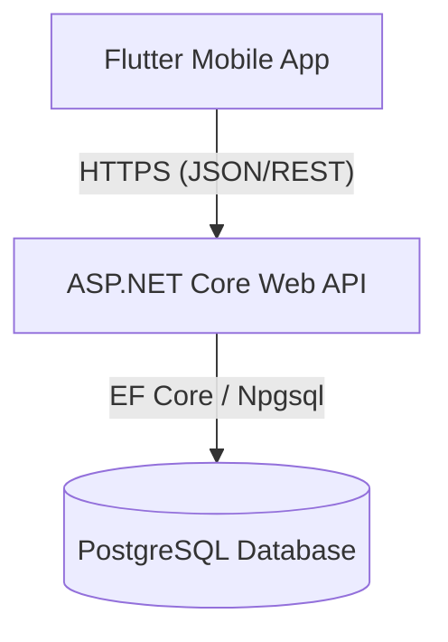

# Antigravity — Adaptive Running App

> A calm, guilt-free running planner designed to help people build consistent running habits and prepare for races without the stress of rigid schedules.

---

## 1. Product Overview & MVP Scope

Antigravity is an adaptive training platform that dynamically adjusts running plans to the user's real-life compliance. Instead of penalizing missed runs, it leverages a supportive design philosophy to adapt future workouts gently.

### MVP (Phase 1) Scope:
- **Calm, Supportive Experience**: Gentle wording and states for missed runs, rest days, and confirmations.
- **Onboarding Flow**: Structured steps collecting goal type, target distance, level of experience, frequency, day-of-week preferences, start date, and plan generation preview.
- **Three Core Tabs**:
  - **Home**: Today's workout details, action buttons (Complete / Not Today), weekly mini-calendar, weekly progress, and dynamic tips. Supports special states like "Plan Completed" and "No Active Plan".
  - **Calendar**: Complete monthly overview mapping completed runs, missed runs, planned runs, and rest days, including monthly summary statistics.
  - **Profile**: Displays weekly stats, active plan summary, options to cancel/stop plans, and settings.
- **Backend & Persistence**: Fully connected ASP.NET Core Web API with PostgreSQL database, migrations, and seed data.
- **Placeholder Adaptation Engine**: Stubbed engine structure that is ready to be swapped out for a real adaptive algorithm in Phase 2.

---

## 2. Architecture Overview

Antigravity is built as a split-client architecture:
1. **Frontend**: A cross-platform mobile app built with Flutter (Dart), utilizing Riverpod for state management, GoRouter for navigation, and Dio for network requests.
2. **Backend**: A clean-architecture ASP.NET Core Web API built with .NET 9, using Entity Framework Core for ORM and Npgsql for PostgreSQL integration.
3. **Database**: PostgreSQL storing user profiles, active plans, generated calendar days, workout completion logs, and "not today" decisions.



---

## 3. Project Structure

### Flutter (Frontend)
Located in `/mobile`:
```
mobile/
├── lib/
│   ├── main.dart                      # App entry point
│   ├── app.dart                       # Root Material App configuration
│   ├── core/                          # Cross-cutting concerns
│   │   ├── network/                   # API client (Dio wrapper), DTOs, bootstrap provider
│   │   ├── routing/                   # GoRouter configuration & routes
│   │   ├── theme/                     # AppTheme, colors, text styles, spacing
│   │   └── widgets/                   # Common reusable widgets (buttons, cards, badges)
│   └── features/                      # Feature modules
│       ├── auth/                      # Welcome screen & sign in / sign up mock flows
│       ├── onboarding/                # Onboarding carousel, goal & day selectors, plan generator
│       ├── plan/                      # Plan details & summary views
│       ├── home/                      # Today's workout card, weekly mini-calendar, daily tips
│       ├── calendar/                  # Grid monthly calendar & month summaries
│       ├── training_day/              # Full-page workout details (planned, completed, missed, rest states)
│       ├── pending_confirmation/       # View & resolve past unlogged workout decisions
│       ├── profile/                   # User stats & stop plan triggers
│       └── settings/                  # Profile settings stub
```

### .NET 9 API (Backend)
Located in `/backend`:
```
backend/
├── RunningApp.sln                     # Visual Studio Solution
├── RunningApp.Api/                    # Controllers, Startup configuration (Program.cs), and appsettings
├── RunningApp.Application/            # Application logic, DTOs, interfaces, and services
├── RunningApp.Domain/                 # Core Entities, Enums, and domain model
├── RunningApp.Infrastructure/         # Future external adapters (placeholder stubs)
└── RunningApp.Persistence/            # Database Context, EF Core Migrations, and seeds
```

---

## 4. Setup & Running Instructions

### Running the Backend

#### Prerequisites:
- .NET 9 SDK
- PostgreSQL database server running (default port `5432`)

#### Instructions:
1. Open [backend/RunningApp.Api/appsettings.json](file:///c:/Users/vatan/Desktop/runner/backend/RunningApp.Api/appsettings.json) and verify or update the connection string:
   ```json
   "ConnectionStrings": {
     "DefaultConnection": "Host=localhost;Database=running_db;Username=postgres;Password=yourpassword"
   }
   ```
2. Navigate to the backend directory:
   ```bash
   cd backend
   ```
3. Run the migrations to initialize the database:
   ```bash
   dotnet ef database update --project RunningApp.Persistence --startup-project RunningApp.Api
   ```
4. Run the API project:
   ```bash
   dotnet run --project RunningApp.Api
   ```
5. Open your browser and navigate to the Swagger Documentation UI:
   - **Swagger UI**: [http://localhost:5001/swagger](http://localhost:5001/swagger)

---

### Running the Flutter Frontend

#### Prerequisites:
- Flutter SDK (stable channel)
- A running emulator (iOS/Android) or a connected physical test device

#### Instructions:
1. Navigate to the mobile directory:
   ```bash
   cd mobile
   ```
2. Retrieve packages:
   ```bash
   flutter pub get
   ```
3. Run the application:
   ```bash
   flutter run
   ```
   *Note:* The Flutter app defaults its API base URL to `http://localhost:5001/api/v1` (or `http://10.0.2.2:5001/api/v1` on Android emulators). This configuration can be adjusted in [mobile/lib/core/network/api_client.dart](file:///c:/Users/vatan/Desktop/runner/mobile/lib/core/network/api_client.dart).

---

## 5. Environment Configuration

### Backend Configuration
Managed in [RunningApp.Api/appsettings.json](file:///c:/Users/vatan/Desktop/runner/backend/RunningApp.Api/appsettings.json):
- `ConnectionStrings:DefaultConnection`: PostgreSQL server coordinates.
- `AllowedHosts`: Restricts incoming requests (configured to `*` for local dev).

### Frontend Configuration
Managed in [mobile/lib/core/network/api_client.dart](file:///c:/Users/vatan/Desktop/runner/mobile/lib/core/network/api_client.dart):
- `_baseUrl`: Pointed to the local development environment API.

---

## 6. Known Placeholders & Future Roadmap

To ensure the MVP Skeleton remains within bounds, the following items are intentionally implemented as stubs/placeholders:

- **Placeholder Adaptation Engine**: Located at `RunningApp.Application/Services/PlaceholderAdaptationEngine.cs`. It acts as a structural placeholder, immediately returning a `NoChange` outcome rather than recalculating dates.
- **Mock Authentication**: There is no live Firebase/Cognito configuration. All requests currently bypass tokens and map back to a hardcoded identity `mock-user-001` on the backend.
- **Seed Templates**: The system seeds 3 core plan templates. Production will require additional configurations for further combinations.
- **Settings & Plan Summary Pages**: Renders simple UI overlays or SnackBar warnings indicating they are future features.

For more details on these limitations, refer to [MVP_LIMITATIONS.md](file:///c:/Users/vatan/Desktop/runner/MVP_LIMITATIONS.md).
For guides on full feature implementation, see [DEVELOPER_HANDOFF.md](file:///c:/Users/vatan/Desktop/runner/DEVELOPER_HANDOFF.md).
